2016/3/5

此处说明基于Microsoft Access 2007以上的版本，用户界面如下图所示：

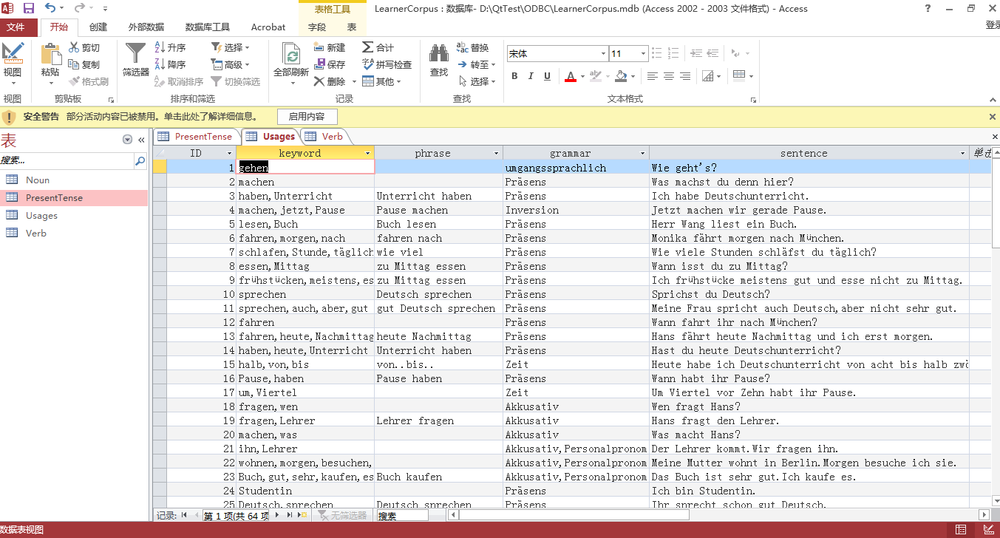{width="5.768055555555556in"
height="3.1034722222222224in"}

目前语料库存有第一册1-7单元的动词信息及其现在时变位，1-6单元名词，1-5单元形容词和少量3，4单元的语法信息。

关于Access的帮助，可参考Microsoft的官方文档，此处说明仅通过若干查询实例来说明学习者语料库的使用方法。

例子一：找出和Leherinnen具有相同词缀的名词:

操作步骤，单击窗口上方的创建选项卡，在创建功能区中选择查询设计，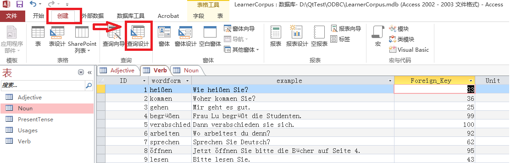{width="5.802083333333333in"
height="1.8541666666666667in"}

在弹出的显示表窗口选中名为Noun的表，单击添加按钮，并关闭显示表窗口。

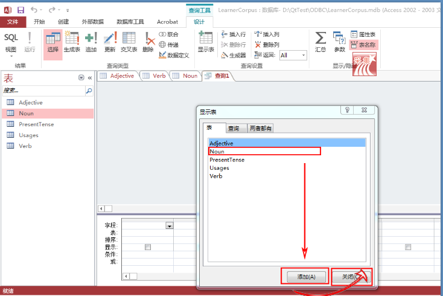{width="5.768055555555556in"
height="3.8506944444444446in"}

在视图的下部，单击字段后的空白单元格，在下拉列表中选中Noun.\*,这表示将显示一个名词的全部信息。然后点击字段后的第二个空白单元格，在下拉列表中选中Plural,在条件一栏输入Like
'\*innen'，这表示将要查询名词复数词缀为-innen的所有单词。其中字符要用单引号括起来，\*表示与任何个数的字符匹配。

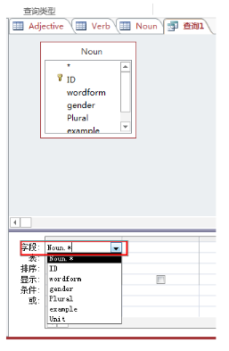{width="2.6770833333333335in"
height="4.09375in"}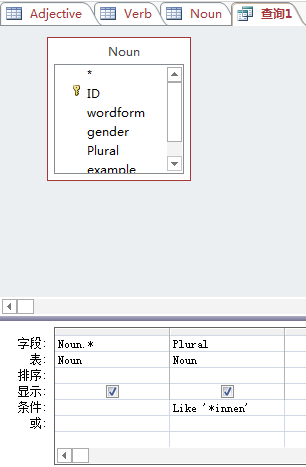{width="3.03125in"
height="4.626123140857393in"}

条件输入完毕后，单击设计功能区的运行按钮，即可得到查询结果。

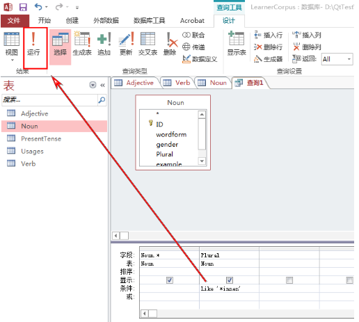{width="5.375in"
height="4.822916666666667in"}

如果例句过长没显示完整，可将鼠标放置在两个标题栏中间位置，拖动鼠标将单元格拉长。

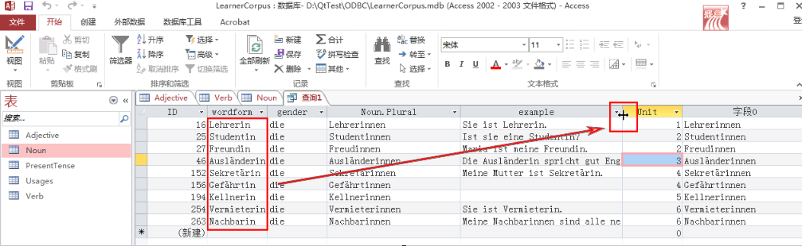{width="5.768055555555556in"
height="1.7756944444444445in"}

单击开始功能区的视图按钮可切换回原查询设计视图修改查询命令：

{width="4.322916666666667in"
height="1.25in"}

例子二：找出所有machen构成的可分动词，前面的操作步骤与例子一相同，先建立一个查询设计，但这次同时添加Verb和PresentTense两张表：

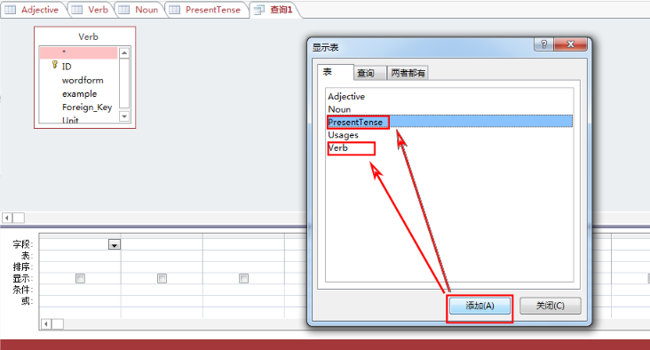{width="5.768055555555556in"
height="3.104861111111111in"}

在字段后面的单元格选中Verb.\*和PresentTense.\*，表示查询结果将把两张表关于动词的信息都显示出来。

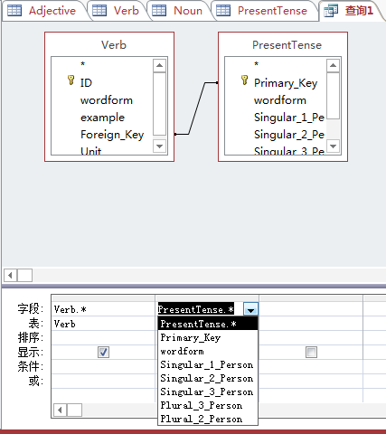{width="4.447916666666667in"
height="5.0in"}

再添加Singular\_1\_Person的一列，在条件一栏写入like 'mache
\*',单击设计功能区的运行即可显示查询结果。基中Singular\_1\_Person表示单数第一人称现在时，对可分动词是词干+空格+介词，注意到上面的单引号里mache后面先加一个空格再加上通配符\*.

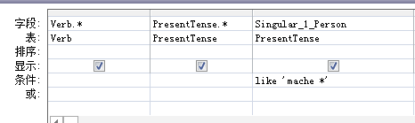{width="4.854166666666667in"
height="1.4479166666666667in"}

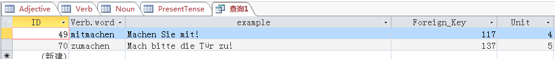{width="5.768055555555556in"
height="0.6125in"}

例子3：找出fahren的例句和与其搭配的短语。先建一个查询设计，选中Usage表并添加，

我们筛选关键词和短语中都含有fahren的句子：

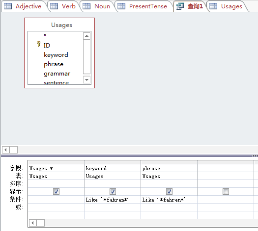{width="5.46875in" height="4.90625in"}

单击运行，得到查询结果：

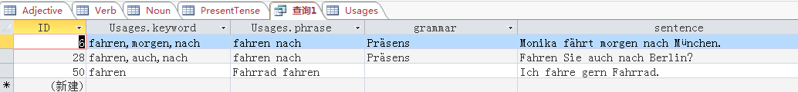{width="5.768055555555556in"
height="0.6694444444444444in"}
