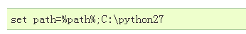
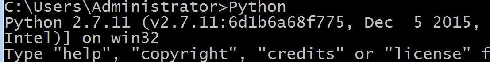
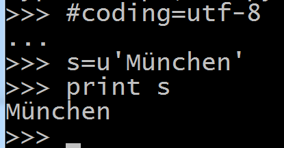
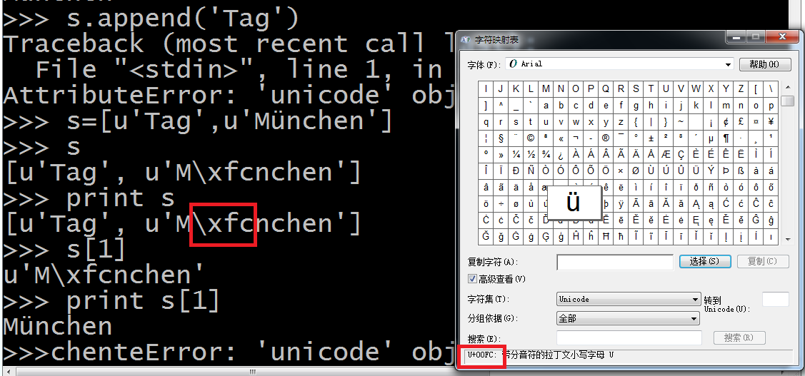
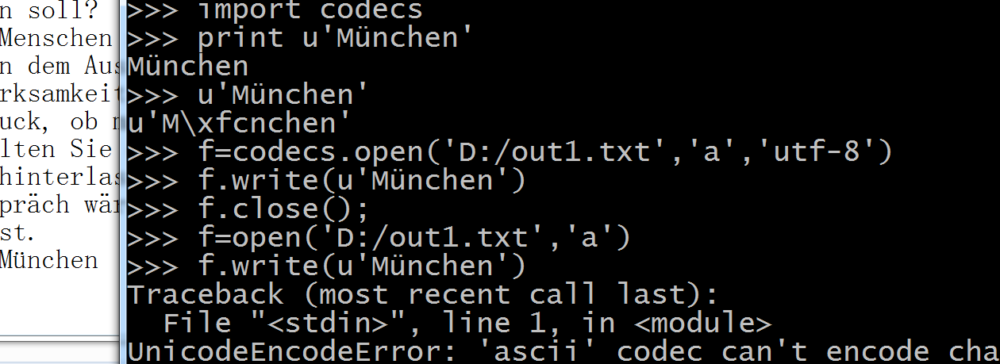
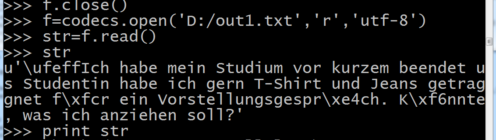
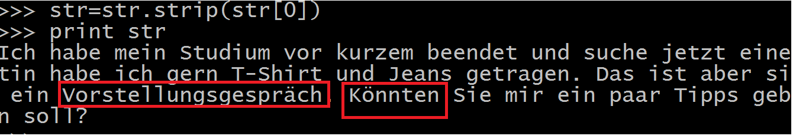

2016/3/9

确保windows
console改为Latin-1的代码页后，在cmd中输入Python（需手动设置环境变量或路径）如{width="3.6041666666666665in"
height="0.5104166666666666in"}

{width="5.768055555555556in"
height="0.7395833333333334in"}

{width="4.322916666666667in"
height="2.2604166666666665in"}

第一行：{width="2.53125in" height="0.25in"}

第三行：指定字符串为unicode编码

{width="7.561936789151356in"
height="3.5416666666666665in"}

注意比较上图中两个红色圈出的地方。

{width="5.768055555555556in"
height="2.1013888888888888in"}

上图为将某德语单词写入文件，先要导入package
codecs里面有codec.open方法的定义。

{width="5.768055555555556in"
height="1.6305555555555555in"}

Print str 会报错，提示信息为：

UnicodeEncodeError: \'charmap\' codec can\'t encode character
u\'\\ufeff\' in position...

Str开头的一个unicode字符complier不认识，去掉后正常输出：

{width="5.760416666666667in"
height="1.0104166666666667in"}。
