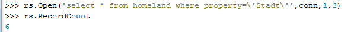
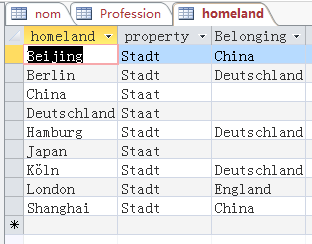

2016/3/10

> **Python 数据库解决方案：**
>
> **下载Python win32 extension,以支持Python调用windows
> api(如Access)。建议使用win32 extension自带的PythonWin 作为IDE调
> 用Access,我在Python Console中import
> 扩展包失败（有待解决），在PythonWin中可以成功，具体操作可见:**
>
> [**http://blog.csdn.net/guoyan19811021/article/details/55521**](http://blog.csdn.net/guoyan19811021/article/details/55521)
>
> **import win32com.client**
>
> **conn=win32com.client.Dispatch(\'ADODB.Connection\')**
>
> **DSN=\'PROVIDER=Microsoft.Jet.OLEDB.4.0;DATASOURCE=D:/QtTest/ODBC/germanWord.mdb;\'**
>
> **conn.Open(DSN)**
>
> **rs=win32com.client.Dispatch(r\'ADODB.Recordset\')**
>
> **连接数据库后，用**
>
> **rs.Open(\'nom\',conn,1,3)打开名为nom的表，要用单引号，双引号会报错。**
>
> **除直接写表名外，也可直接用sql语句:**
>
> {width="5.768055555555556in"
> height="0.5215277777777778in"}
>
> **Sql语句中Stadt两边单引号要用转义字符\\**
>
> **打印6条记录的第一个字段：**
>
> {width="3.3541666666666665in"
> height="2.2291666666666665in"}
>
> **原表：**{width="3.25in"
> height="2.5416666666666665in"}
>
> **也可直接对conn操作，主要来更新数据：**

**conn.Execute(\'update homeland set Belonging =\\\'China\\\' where
homeland =\\\'Beijing\\\'\')**

**conn.Execute(\'insert into homeland values
(\\\'Madrid\\\',\\\'Stadt\\\',\\\'Spain\\\')\')**

**//use pyodbc to connect to access database**

import pyodbc

DBfile = \'/data/MSAccess/Music\_Library.mdb\'

conn = pyodbc.connect(\'DRIVER={Microsoft Access Driver
(\*.mdb)};DBQ=\'+DBfile)

\#use below conn if using with Access 2007, 2010 .accdb file

\#conn = pyodbc.connect(r\'Driver={Microsoft Access Driver (\*.mdb,
\*.accdb)};DBQ=\'+DBfile)

cursor = conn.cursor()

SQL = \'SELECT Artist, AlbumName FROM RecordCollection ORDER BY Year;\'

for row in cursor.execute(SQL): \# cursors are iterable

print row.Artist, row.AlbumName

\# print row \# if print row it will return tuple of all fields

cursor.close()

conn.close()
