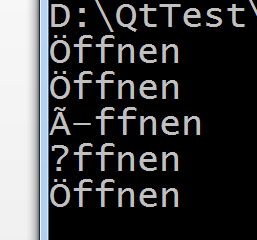

2016/1/28

{width="5.768055555555556in"
height="1.1722222222222223in"}

{width="5.768055555555556in"
height="1.0569444444444445in"}

建议Qt默认编码取UTF-8，因为GBK中似乎没有ß ö ä 三个字符，不过有­­ü.

我之前有的工程默认编码取system后，前面三个德文字符怎么也打不出来。

即使有默认编码UTF-8，在输出非英文字符时还要加上前缀QString::fromUtf8("要打印的内容")。关于原理部分，可参照"在水一方"的博客，这里给出一个示例程序：

在默认编码如上设置后：

在main函数中写:

QTextStream cout1(stdout);

QTextCodec::setCodecForCStrings(QTextCodec::codecForName(\"UTF-8\"));

cout1.setCodec(\"ISO 8859-1\");//使与输出设备的代码页相同

QString str1=\"Öffnen\";

cout1\<\<str1\<\<flush\<\<endl;

cout1\<\<QString(\"Öffnen\")\<\<flush\<\<endl;

cout1\<\<\"Öffnen\"\<\<flush\<\<endl;

QTextCodec::setCodecForCStrings(QTextCodec::codecForName(\"GBK\"));

cout1\<\<QString(\"Öffnen\")\<\<flush\<\<endl;

cout1\<\<QString::fromUtf8(\"Öffnen\")\<\<flush\<\<endl;

打开cmd, 输入chcp 1252,将代码页换到Latin-1（等价于ISO 8859-1）

调整窗口大小、显示字体后。

用改过codepage
的cmd打开编译后的exe文件(不要直接运行，因为运行后弹出的cmd默认编码还是GBK)

输出结果为

{width="2.6770833333333335in"
height="2.5in"}可以看到QTextCodec::setCodecForCStrings的作用是使得后面对QString
的赋值对象以UTF-8被编码，但直接输出

cout1\<\<\"Öffnen\"

似乎就只是输出const char\*

改了编码方式为GBK则无法正确编码，

但用QString::fromUtf8则直接指定编码方式为UTF-8.
