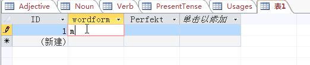

2016/3/5

德语学习小型语料库维护说明：

{width="2.125in"
height="1.9479166666666667in"}现有数据库含有5个表：Adjective, Noun,
Verb分别存储实词的三个大类，PresentTense存储动词各人称的现在时变位，Usages表是以句子为中心存储相应的标记。

名词表的字段含有"性"(gender)，"复数"(Plural)和例句（example，出自课本单词表），例句后附上该名词第一次出现的单元;

{width="5.768055555555556in"
height="0.4222222222222222in"}

形容词的表与名词的表类似，但没有变位信息：

{width="5.768055555555556in"
height="0.7486111111111111in"}

动词表比起形容词的表，多出一个Foreign\_Key,
里面的数字存储了Present\_Tense表中的主键（Primary\_Key）的编号，这是出于建立两个表之间的"关系"的需要。

{width="5.768055555555556in"
height="0.8520833333333333in"}

PresentTense表中设有

Singular\_1\_Person,Singular\_2\_Person,Singular\_3\_Person,Plural\_3\_Person,Plural\_2\_Person,Plural\_3\_Person五个字段，分别存储动词的相应人称的现在时变位，考虑到在变位方面的规律性，可采用机器变位和人工检查相结合的办法加快工作进度：

{width="5.768055555555556in"
height="0.8402777777777778in"}

Usages表中除句子字段外设有语法（grammar）,keyword(关键词)，和短语(phrase)三个字段，分别存储该句的语法点，所含重要的词汇，和所含重要的短语（或搭配）。

{width="5.768055555555556in"
height="0.8916666666666667in"}

由于王老师不太支持仅局限在课本上，而上面的框架主要是为课本量身订做，故在维护语料库时不宜直接在原表添加单词和句子，可采用建立新表的方法，具体操作步骤如下：

在创建选项卡的功能区中单击"表"，则新建立一张表，这里以建立存储"完成时"变位为例进行演示。

{width="5.71875in"
height="2.7604166666666665in"}

在表的显示窗口找到"单击以添加"字段，输入要添入的字段类型（字符型用短文本）和名称：{width="5.768055555555556in"
height="3.627083333333333in"}

继续添加字段：

{width="5.768055555555556in"
height="1.4402777777777778in"}

在wordform字段下可输入内容，Access会自动对该项进行编号，{width="5.4368208661417325in"
height="1.1561056430446195in"}

Ctrl+S保存新建的表：

{width="5.768055555555556in"
height="1.5930555555555554in"}

Access中可以建立各表之间的关系，这样在查询过程中Access会自动把有关系的各表连接起来。这里以建立Verb表和PerfectTense表为例演示建立关系的方法：{width="5.768055555555556in"
height="1.4375in"}

首先要在Verb表中建立一个新的字段，外键（Foreign\_Key\_2），数据类型是数字，里面存储了PerfectTense主键(ID)的数字，利用Ctrl+F的搜索功能或其他方法找到ID为11和12的machen这个词，在其Foreign\_Key\_2属性上添加machen在PerfectTense的主键ID

{width="5.768055555555556in"
height="0.36666666666666664in"}

继续添加lernen

{width="5.768055555555556in"
height="0.34652777777777777in"}

对于大量的词，可考虑用机器自动添加的方法，但需要自己编写程序，这里不作介绍。

接下来在数据库工具选项卡的功能区选择"关系"，

{width="5.768055555555556in"
height="1.2236111111111112in"}

可看到已经建立好的关系：

{width="5.768055555555556in"
height="2.3722222222222222in"}

选择设计选项卡功能区的"显示表"，在弹出的窗口选择PerfectTense,并添加：

{width="5.768055555555556in"
height="3.18125in"}

用鼠标左键按住Verb表上的Foreign\_Key\_2,脱动到PerfectTense表中的ID,松开鼠标左键，弹出编辑关系窗口，点击创建即可建立关系。

{width="5.768055555555556in"
height="1.8104166666666666in"}

建立关系后查询动词可以显示PerfectTense的信息，查询设计如下（具体设置可参考《Access学习者语料库查询方法介绍》）。

{width="5.768055555555556in"
height="3.8020833333333335in"}

显示结果：

{width="5.768055555555556in"
height="0.6083333333333333in"}

。
