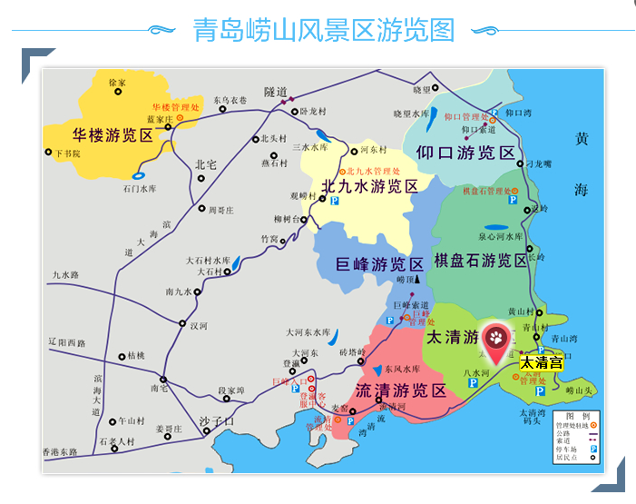

**崂山景区攻略**
2017/6/17

**1.总体安排:**

计划时长为上下午,早上从青岛市区住地打车前往太清游览区，学生票45元/人，主要游览太清宫（门票27元/人）等地，中午在XX地吃农家宴，饭后乘观光车（车票45元/人）前往棋盘石游览区在华严寺等地参观，稍后乘观光车前往仰口游览区，在仰口湾看海，乘观光车前往流清游览区，在流清游览区打车回市区吃晚饭。

**2.景区图示:**

{width="5.768055555555556in"
height="4.566666666666666in"}

3.游览的注意事项：

-   崂山景区处于旅游旺季，部分内部景区需要单独购票以及观光车等车、中午找地方吃饭等可能需要占用超过预期的时间，具体浏览的景点需要灵活调整，大家需要做好心理预期。

-   如果有同学与大部队走散，需要及时和班长或负责的同学取得联系，不建议单独游览。如果有同学因中暑等原因中途无法继续游览，可乘观光车前往流清游览区休息，等待大部队游完一同离开崂山。

-   在具体某景点考虑采取某某时间在出口处集合的方法增加游览的灵活性。
